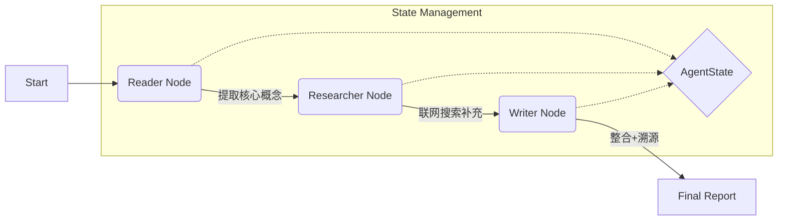
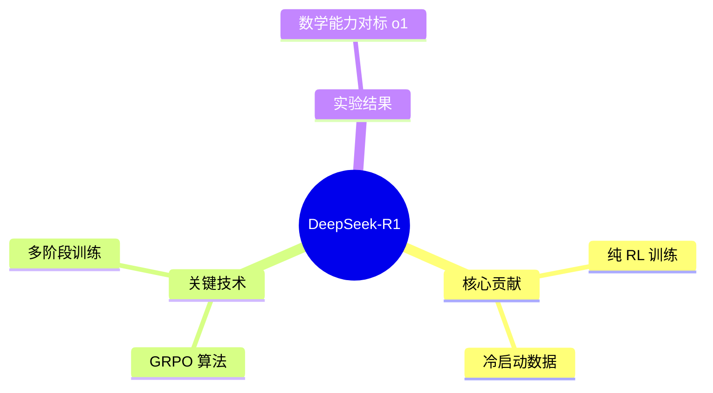

# 🧠 Paper-Agent: 深度论文研读智能体


> 一个基于 **LangGraph** 构建的自主 AI 智能体。它不仅能阅读 PDF 论文，还能像人类研究员一样**自主联网搜索**背景知识，最终生成一份包含**页码溯源**、**网络补充**、**思维导图**和**代码复现**的深度技术报告。

---

## 🌟 核心亮点 (Key Features)

这个项目旨在解决传统 RAG（检索增强生成）系统“幻觉严重”和“知识封闭”的两大痛点：

*   **🔍 严谨的页码溯源 (Page-Level Citation)**
    *   拒绝黑盒摘要。Agent 生成的每一条来自论文的观点，都会在句尾强制标注 `[Page X]`，实现 100% 可验证性。
*   **🌐 动态联网增强 (Active Web Research)**
    *   遇到论文中未详细展开的生僻术语（如 "GRPO", "PPO"），Agent 会自动挂起写作任务，调用搜索 API 获取最新解释，并以 `> 🌐 网络补充` 的形式显式展示增量信息。
*   **📊 结构化多模态输出**
    *   自动生成 **Mermaid 思维导图**，一览全文脉络。
    *   针对算法逻辑，自动推演并生成 **Python 伪代码**。
*   **🧠 可视化思考链路 (Chain of Thought)**
    *   完整保留 Agent 的决策日志：从阅读、提取概念、决定搜索关键词到最终写作的全过程可见。

---

## 🏗️ 架构设计 (Architecture)

本项目采用多智能体协作模式 (Multi-Agent Collaboration)，基于 `LangGraph` 状态机管理：



1.  **Reader Node**: 使用 `pypdf` 进行分块读取，保留页码元数据，提取 Key Concepts。
2.  **Researcher Node**: 针对提取的难点概念，使用 Search API 进行外部知识检索。
3.  **Writer Node**: 综合“内部知识（PDF）”与“外部知识（Web）”，按照严格的 Prompt 约束生成 Markdown 报告。

---

## 🚀 效果展示 (Demo)

### 1. 报告片段：引用与网络补充的隔离

> DeepSeek-R1 的训练过程采用了群体相对策略优化（GRPO）算法，旨在通过最大化奖励来优化策略模型 **[Page 6]**。
>
> > 🌐 **网络补充 / 背景知识**：
> > 经检索，GRPO (Group Relative Policy Optimization) 相比于传统 PPO 算法，去除了 Critic 价值网络，通过组内采样计算 Baseline，显著降低了显存占用。

### 2. 自动生成的思维导图



---

## 🛠️ 快速开始 (Quick Start)

### 1. 克隆项目
```bash
git clone https://github.com/Fengreny/paper-agent
cd paper-agent
```

### 2. 安装依赖
```bash
pip install -r requirements.txt
```

### 3. 配置环境变量
复制 `.env.example` 为 `.env`，并填入你的 API Key：
```ini
# LLM Provider (OpenAI / DeepSeek / Azure)
OPENAI_API_KEY=sk-xxxxxx
OPENAI_BASE_URL=https://api.openai.com/v1

# Search Tool (Tavily or DuckDuckGo)
TAVILY_API_KEY=tvly-xxxxxx
```

### 4. 运行 Agent
```bash
# 读取本地 PDF 并生成报告
python main.py --paper ./papers/deepseek-r1.pdf --out ./reports/output.md
```

---

## 📂 项目结构

```text
DeepResearch-Agent/
├── agent.py           # 核心逻辑：LangGraph 节点与工作流定义
├── schema.py          # 数据结构：定义 AgentState 与 PDFPage
├── tools/
│   ├── pdf_utils.py   # PDF 处理：带页码的文本提取
│   └── web_search.py  # 联网搜索工具封装
├── main.py            # 入口文件：CLI 命令行交互
└── requirements.txt   # 项目依赖
```

---

## 🔮 未来计划 (Roadmap)

- [ ] **Web UI**: 基于 Streamlit/Gradio 开发可视化界面。
- [ ] **多论文综述**: 支持一次性输入文件夹下的多篇 PDF，生成横向对比综述。
- [ ] **本地模型支持**: 适配 Ollama，支持完全离线运行 (Llama 3, Mistral)。

---

## 🤝 关于作者

**Jintao**
*   专注于大模型应用开发 (LLM Application) 与 Agentic Workflow 研究。
*   熟悉 Python, LangChain, NLP 理论与实践。
*   正在探索 AI 辅助科研的新范式。

---

*If you find this project helpful, please give it a star! ⭐️*
