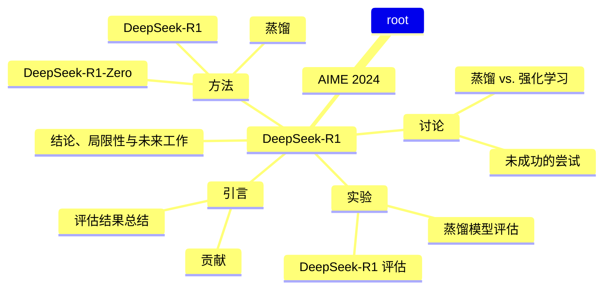

# 深度技术报告：DeepSeek-R1与DeepSeek-R1-Zero的推理能力提升

## 1. 引言

近年来，大型语言模型（LLMs）在推理能力方面取得了显著进展。本文介绍了DeepSeek-R1和DeepSeek-R1-Zero两个模型，前者通过多阶段训练和冷启动数据提升推理性能，后者则通过纯强化学习（RL）实现推理能力的自我进化。DeepSeek-R1在多个基准测试中表现出色，尤其是在数学和编码任务上，显示出与OpenAI的o1-1217模型相当的性能 [Page 3]。

### 1.1 贡献

- **训练后**：DeepSeek-R1-Zero展示了通过大规模强化学习提升推理能力的潜力，而无需监督微调（SFT）作为初步步骤 [Page 4]。
- **蒸馏**：通过将推理能力蒸馏到小型模型中，DeepSeek-R1的输出显著提升了小型模型的性能，展示了蒸馏技术的有效性 [Page 4]。

### 1.2 评估结果总结

DeepSeek-R1在AIME 2024上取得了79.8%的Pass@1分数，略微超过OpenAI-o1-1217 [Page 4]。在MATH-500上，DeepSeek-R1的得分为97.3%，显示出其在数学推理任务中的强大能力 [Page 4]。

## 2. 方法

### 2.1 概述

DeepSeek-R1-Zero直接将RL应用于基础模型，而不依赖于SFT。这一方法使模型能够探索思维链（CoT）以解决复杂问题 [Page 5]。DeepSeek-R1则结合了冷启动数据和多阶段训练流程，以进一步提升推理性能 [Page 5]。

### 2.2 DeepSeek-R1-Zero：基础模型上的强化学习

DeepSeek-R1-Zero的训练过程采用了群体相对策略优化（GRPO）算法，旨在通过最大化奖励来优化策略模型 [Page 6]。以下是GRPO的核心逻辑示例：

```python
def grpo_update(old_policy, new_policy, rewards, epsilon, beta):
    advantages = rewards - np.mean(rewards)
    for i in range(len(rewards)):
        ratio = new_policy[i] / old_policy[i]
        clipped_ratio = np.clip(ratio, 1 - epsilon, 1 + epsilon)
        loss = -np.mean(np.minimum(clipped_ratio * advantages[i], advantages[i]))
        # Update policy using gradient descent
        update_policy(new_policy, loss, beta)
```

### 2.3 DeepSeek-R1：冷启动强化学习

DeepSeek-R1在RL训练之前引入了冷启动数据，以提高模型的可读性和推理能力。冷启动数据的设计考虑了可读性和潜力，确保模型在推理任务中表现更佳 [Page 10]。

### 2.4 蒸馏：赋予小模型推理能力

通过将DeepSeek-R1的推理能力蒸馏到小型模型中，研究表明，蒸馏后的模型在多个基准测试中表现优于未蒸馏的模型 [Page 11]。

## 3. 实验

### 3.1 DeepSeek-R1 评估

DeepSeek-R1在多个基准测试中表现出色，尤其是在数学和编码任务上，显示出其强大的推理能力 [Page 13]。

### 3.2 蒸馏模型评估

蒸馏后的DeepSeek-R1-Distill-Qwen-7B在AIME 2024上达到了55.5%的得分，超越了QwQ-32B-Preview [Page 14]。

## 4. 讨论

### 4.1 蒸馏 vs. 强化学习

蒸馏技术在提升小型模型性能方面表现出色，但大规模RL训练仍然是提升模型智能的关键 [Page 15]。

### 4.2 未成功的尝试

在开发过程中，研究团队经历了多次失败，特别是在使用过程奖励模型（PRM）和蒙特卡洛树搜索（MCTS）时，未能达到预期效果 [Page 15]。

## 5. 结论、局限性与未来工作

DeepSeek-R1和DeepSeek-R1-Zero展示了通过强化学习提升推理能力的潜力。未来的研究将集中在提升模型的通用能力和处理多语言查询的能力上 [Page 16]。

---

### Agent 思考日志

1. **理解论文内容**：仔细阅读论文，提取关键信息。
2. **联网搜索**：查找相关概念的解释，补充背景知识。
3. **结构化报告**：根据论文结构组织内容，确保逻辑清晰。
4. **代码实现**：将算法逻辑转化为Python代码，展示核心思想。
5. **总结与反思**：对研究成果进行总结，提出未来研究方向。

--- 

通过以上步骤，本文深入探讨了DeepSeek-R1和DeepSeek-R1-Zero的推理能力提升，展示了强化学习在大型语言模型中的应用潜力。