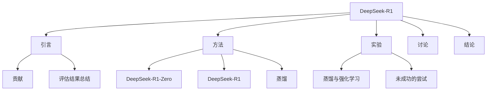

```markdown
# DeepSeek-R1: 通过强化学习提升推理能力的技术报告

## 思维导图


## 1. 引言
近年来，大型语言模型（LLMs）在推理能力方面取得了显著进展。本文介绍了DeepSeek-R1及其前身DeepSeek-R1-Zero，这些模型通过强化学习（RL）提升了推理能力，尤其是在数学、编码和科学推理等任务中表现出色 [Page 3]。

### 1.1 贡献
- **无监督强化学习**：DeepSeek-R1-Zero展示了通过纯RL提升推理能力的潜力，而无需监督微调（SFT）作为初步步骤 [Page 4]。
- **冷启动数据**：DeepSeek-R1结合了冷启动数据和多阶段训练流程，进一步提升了推理性能 [Page 4]。
- **蒸馏技术**：通过蒸馏，较小模型也能获得强大的推理能力，开源的DeepSeek-R1及其API将为研究社区提供支持 [Page 4]。

### 1.2 评估结果总结
DeepSeek-R1在多个基准测试中表现优异，例如在AIME 2024上取得79.8%的Pass@1分数，略微超过OpenAI-o1-1217 [Page 4]。

## 2. 方法
### 2.1 概述
本研究展示了在没有监督数据的情况下，通过大规模强化学习显著提升推理能力的潜力。DeepSeek-R1-Zero直接将RL应用于基础模型，而DeepSeek-R1则在此基础上引入了冷启动数据 [Page 5]。

### 2.2 DeepSeek-R1-Zero：基础模型上的强化学习
DeepSeek-R1-Zero通过群体相对策略优化（GRPO）算法进行训练，展示了自我进化的能力 [Page 5]。

> 🌐 **网络补充 / 背景知识**：
> GRPO (Group Relative Policy Optimization) 是一种不需要价值网络（Value Network）的强化学习算法，它通过从旧策略中采样输出，优化策略模型以最大化奖励信号。

#### 伪代码示例
```python
def GRPO_update(old_policy, new_policy, rewards):
    for each query in queries:
        sampled_outputs = sample_from(old_policy, query)
        advantages = compute_advantages(rewards, sampled_outputs)
        new_policy.update(advantages)
```

### 2.3 DeepSeek-R1：冷启动强化学习
DeepSeek-R1在RL训练前引入了冷启动数据，以提高模型的可读性和推理能力。冷启动数据的设计旨在确保生成的输出更具可读性 [Page 10]。

### 2.4 蒸馏：赋予小模型推理能力
通过将DeepSeek-R1的知识蒸馏到小型模型中，研究表明小模型也能获得与大型模型相当的推理能力 [Page 11]。

> 🌐 **网络补充 / 背景知识**：
> 知识蒸馏（Knowledge Distillation）是一种模型压缩技术，通过将大型模型（教师模型）的知识转移到小型模型（学生模型）中，使得小型模型在性能上接近大型模型。

## 3. 实验
### 3.1 DeepSeek-R1评估
DeepSeek-R1在多个基准测试中表现优异，尤其是在数学和编码任务中，显示出其强大的推理能力 [Page 13]。

### 3.2 蒸馏模型评估
蒸馏后的模型在各项评估中均表现出色，尤其是DeepSeek-R1-Distill-Qwen-32B在多个基准测试中超越了其他开源模型 [Page 14]。

## 4. 讨论
### 4.1 蒸馏与强化学习
蒸馏技术与强化学习的结合为模型的推理能力提升提供了新的思路。尽管蒸馏模型在性能上优于单纯依赖RL训练的模型，但后者在某些情况下仍具有潜力 [Page 15]。

### 4.2 未成功的尝试
在开发过程中，研究团队经历了多次失败，特别是在使用过程奖励模型（PRM）和蒙特卡洛树搜索（MCTS）时遇到的挑战 [Page 16]。

## 5. 结论、局限性与未来工作
DeepSeek-R1展示了通过强化学习提升推理能力的有效性，未来的研究将集中在提升模型的通用能力和处理多语言查询的能力上 [Page 17]。

---

**参考文献**
- 论文原文及相关文献 [Page 1-20]。
- 其他网络资源和背景知识 🌐。
```


## 🕵️ Agent 思考日志
- ✅ 成功读取 PDF，共 23 页。
- 🧠 提取到核心概念: 强化学习（Reinforcement Learning）, 大型语言模型（LLMs）, 推理能力（Reasoning Ability), 冷启动数据（Cold Start Data）, 蒸馏（Distillation）
- 🌐 开始联网搜索背景知识...
-    -> 已搜索 '强化学习（Reinforcement Learning）'，获取了相关资料。
-    -> 已搜索 '大型语言模型（LLMs）'，获取了相关资料。
-    -> 已搜索 '推理能力（Reasoning Ability)'，获取了相关资料。
-    -> 已搜索 '冷启动数据（Cold Start Data）'，获取了相关资料。
-    -> 已搜索 '蒸馏（Distillation）'，获取了相关资料。
- ✍️ 正在撰写最终报告...